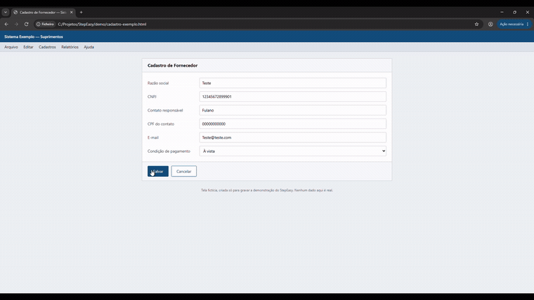

Gravador de passo a passo local, open source e multiplataforma, escrito em Rust — a evolução do **Gravador de Passos (PSR)** do Windows.

O PSR foi descontinuado, exporta só MHTML e não deixa editar nada depois de gravar. O StepEasy grava a interação (clique/tecla → screenshot + descrição) e, principalmente, deixa **editar a gravação depois**: reordenar, excluir, mesclar e reescrever passos antes de exportar.

> Status: **v0.1** — utilizável no Windows. Linux e macOS abrem e editam
> gravações, mas ainda não capturam.



*Escolher o que capturar, gravar, borrar o que é sigiloso, apontar o que importa — e exportar.*

## Instalação

Na [última release](https://github.com/GabrielAhlert/StepEasy/releases) há duas formas:

- **`stepeasy-<versão>-setup.exe`** — instalador. Instala só para o seu usuário,
  em `%LOCALAPPDATA%\Programs`, sem pedir administrador. Cria atalho no menu
  Iniciar e, se você quiser, associa os arquivos `.stepeasy`.
- **`stepeasy-windows-x86_64.zip`** — portátil. Extraia e rode; não instala nada.

O Windows mostra um aviso do SmartScreen na primeira execução, porque o
executável ainda não é assinado — em "Mais informações", "Executar assim mesmo".

## Demonstração

O vídeo completo (2 min) mostra a gravação, a edição dos passos, as anotações e
o HTML exportado no fim.

https://github.com/user-attachments/assets/b0114c5e-e28f-4bb2-bb39-15b4b4d2c67d

## Princípios

- **100% local.** Nada sai da máquina. Zero telemetria.
- **Formato aberto.** `.stepeasy` é um zip com `manifest.json` + PNGs. Sem lock-in.
- **Binário único.** Interface em [egui](https://github.com/emilk/egui), sem runtime web, sem instalador obrigatório.

## Escopo de captura

Escolhido antes de gravar:

| Modo | O que entra na imagem |
|---|---|
| Tela sob o cursor | O monitor onde o clique aconteceu (padrão) |
| Tela específica | Um monitor fixo escolhido por você |
| Todas as telas | O canvas virtual inteiro |
| Janela ativa | Só a janela em foco, recortada |
| Região | Um retângulo fixo que você seleciona |

## Durante a gravação

| Atalho | O que faz |
|---|---|
| `Ctrl+Shift+F9` | Encerra a gravação |
| `Ctrl+Shift+F10` | Pausa e retoma |

Os dois funcionam com a janela minimizada: são tratados dentro do próprio fluxo
de eventos capturados, e não pela janela do aplicativo.

Uma gravação já aberta pode ser continuada — os passos novos entram no fim, sem
apagar nem renumerar os que já existem. `Ctrl+Z` desfaz a continuação inteira.

## Anotações

Sobre a captura de cada passo dá para desenhar:

| Ferramenta | Para quê |
|---|---|
| Seta | Apontar o que clicar |
| Retângulo | Cercar a região que importa |
| Borrão | Sumir com senha, CPF, nome de cliente antes de mandar o tutorial para fora |
| Texto | Escrever direto na imagem, com halo de contraste |

No editor elas são desenhadas por cima da imagem, então apagar uma seta não custa qualidade da captura. Quem grava nos pixels é o export.

## Roadmap

**v0.1** — captura no Windows, editor com reordenação/edição/mesclagem e undo/redo, anotações, autosave com recuperação, formato `.stepeasy`, export Markdown e HTML.

**Depois** — Linux (AT-SPI) e macOS (AX API), redação automática de dados sensíveis, export PDF/DOCX, vídeo/GIF, diff entre gravações, export para Playwright.

## Compilando

```bash
cargo run --release
```

Passar um caminho abre a gravação direto no editor (é o que faz o "Abrir com" do
Explorer funcionar):

```bash
cargo run --release -- minha-gravacao.stepeasy
```

Para mexer no editor sem precisar gravar nada — inclusive onde a captura ainda
não existe — dá para gerar uma gravação sintética:

```bash
cargo run -p stepeasy-core --example gravacao_exemplo -- exemplo.stepeasy
```

## Estrutura

```
crates/
  stepeasy-core/     modelo de dados, formato .stepeasy, exportadores
  stepeasy-capture/  hooks de entrada, screenshot e acessibilidade por plataforma
  stepeasy-ui/       interface egui (gravador + editor)
  stepeasy/          binário
assets/
  logo/              SVGs da marca
  icons/             PNG e ICO gerados a partir do logo
demo/                roteiro, tela fictícia e script de conversão da demonstração
installer/           script do instalador (Inno Setup)
```

Os ícones ficam versionados para compilar o StepEasy não depender de um
rasterizador de SVG. Quando o logo mudar, regenere:

```bash
cargo run -p stepeasy --example gerar_icones
```

O instalador é um script do [Inno Setup 6](https://jrsoftware.org/isinfo.php) em
`installer/stepeasy.iss`. Para gerá-lo na sua máquina, depois de um build de
release:

```bash
"C:\Program Files (x86)\Inno Setup 6\ISCC.exe" /DMyAppVersion=0.1.0 installer\stepeasy.iss
```

A saída vai para `dist/`. No CI a versão vem da tag, então o instalador nunca
discorda dela.

## Contribuindo

Traduzir é a forma mais rápida de ajudar: copiar um arquivo e traduzir texto,
sem precisar de Rust. Veja **[TRANSLATING.md](TRANSLATING.md)**.

Para o resto — como compilar, rodar os testes e o que o CI exige — veja
[CONTRIBUTING.md](CONTRIBUTING.md). Falhas de segurança em
[SECURITY.md](SECURITY.md), nunca em issue pública.

## Licença

MIT.

O texto das anotações é rasterizado com a fonte **Ubuntu**, que vem do crate
`epaint_default_fonts` (o mesmo pacote de fontes que o egui usa) e é
distribuída sob a [Ubuntu Font Licence 1.0](https://ubuntu.com/legal/font-licence).
